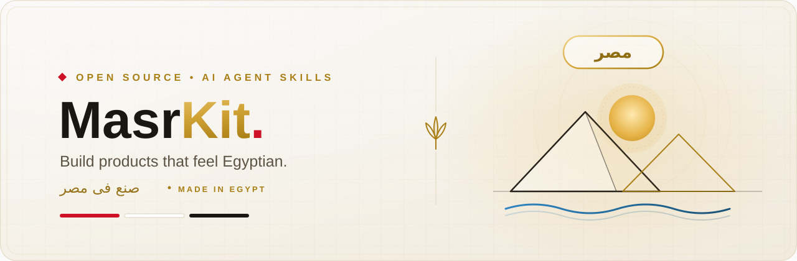

<div align="center">




# 🇪🇬 MasrKit 🇪🇬

### Build products that feel Egyptian.

Open-source AI agent skills for building digital products that feel truly Egyptian, not merely translated into Arabic.

<p>
  
  
  
  
  
  <a href="https://www.skills.sh/asasemahmed/masrkit"></a>
</p>

[Quick start](#quick-start) · [Explore the skills](#the-skills) · [See examples](#examples) · [View on skills.sh](https://www.skills.sh/asasemahmed/masrkit) · [Read in Arabic](README.ar.md)

</div>

---

> **The principle:** Build for the way people read, write, decide, pay, recover, and trust, not for an English screen with Arabic strings dropped into it.

MasrKit is a vendor-neutral skill library for AI coding agents. It gives agents practical product, content, frontend, RTL, audit, and backend guidance for Egyptian-facing software while keeping the source readable as ordinary Markdown.

Use it with Codex, Claude Code, Gemini CLI, Cursor-like agents, or any tool that can load instruction files.

## Why MasrKit?

Arabic localization is not a translation pass. A page can contain correct Arabic and still fail because:

- its RTL layout reverses the wrong things;
- its phone numbers and IDs become unreadable;
- its copy sounds translated, overly formal, or theatrically slang-heavy;
- its checkout assumes payment or delivery behavior that the product does not support;
- its backend stores money as floating point or treats Egypt as a permanent UTC offset;
- its success message appears while the transaction is still pending.

MasrKit turns those failure modes into reusable instructions, decision frameworks, examples, anti-patterns, and completion checklists.

| Generic localization request | MasrKit-shaped request |
|---|---|
| “Translate the checkout to Arabic and align it right.” | “Design an Arabic-first checkout for Egypt. Choose the copy register, implement semantic RTL, preserve phone and payment identifiers, show EGP intentionally, and cover pending and recovery states without inventing payment support.” |

## The skills

### Arabic foundations

| Skill | What it helps an agent do |
|---|---|
| **[`arabic-ui`](skills/arabic-ui/SKILL.md)** | Design readable Arabic typography, hierarchy, forms, navigation, dashboards, responsive components, feedback states, and accessible interactions. |
| **[`arabic-rtl`](skills/arabic-rtl/SKILL.md)** | Implement robust RTL with logical CSS, bidi isolation, correct icon behavior, tables, charts, React/Next.js, Tailwind, and browser checks. |

### Egypt-specific product guidance

| Skill | What it helps an agent do |
|---|---|
| **[`egyptian-copy`](skills/egyptian-copy/SKILL.md)** | Choose the right Arabic register and write natural Egyptian product copy without literal translation, forced English, or caricature. |
| **[`egyptian-product-ux`](skills/egyptian-product-ux/SKILL.md)** | Design mobile-resilient flows for phone/OTP, addresses, EGP, payments, trust, support, uploads, and interrupted sessions. |
| **[`egyptian-web-audit`](skills/egyptian-web-audit/SKILL.md)** | Run evidence-based quick, full, content, RTL, or UX audits with actionable findings instead of arbitrary scores. |
| **[`egyptian-backend`](skills/egyptian-backend/SKILL.md)** | Model Arabic text, search, phones, exact money, time, notifications, OTP, uploads, security, and provider adapters safely. |
| **[`egyptian-session-report`](skills/egyptian-session-report/SKILL.md)** | Summarize completed session work in natural Egyptian Arabic and deliver it as a clean RTL HTML report with Cairo font and a light/dark toggle. |

### Content quality

| Skill | What it helps an agent do |
|---|---|
| **[`humanizer`](skills/humanizer/SKILL.md)** | Rewrite mechanical text into natural prose, remove long dashes and decorative marks when requested, and preserve meaning, facts, technical tokens, and voice. |

Every skill works independently. Load only the combination your task needs.

## Quick start

### Recommended: the skills CLI

MasrKit is listed on [skills.sh](https://www.skills.sh/asasemahmed/masrkit), the open agent skills directory. Install every skill for your agent with one command (Node.js 18 or newer):

```bash
npx skills add asasemahmed/masrkit
```

The CLI asks which skills and which agents to install for. To pick skills without prompts:

```bash
npx skills add asasemahmed/masrkit --skill arabic-rtl --skill egyptian-copy -y
```

Use `-g` for a user-level install, `npx skills list` to see what is installed, and `npx skills update` to pull the latest versions.

### Option A: npm and npx from a local checkout

Use the package directly from a cloned repository with Node.js 18 or newer:

```bash
npx --yes . --all --target codex --dry-run
npx --yes . --all --target codex
```

Install the command globally from the local checkout:

```bash
npm install --global .
masrkit --skill humanizer --target codex
```

The package is prepared for npm distribution. Until an official package release is published, use the local checkout commands above rather than assuming that a registry package exists.

### Option B: Python

The Python installer requires Python 3.9 or newer:

```bash
python scripts/install.py --all --target codex --dry-run
python scripts/install.py --all --target codex
```

### Installer behavior

Both installers use the same canonical `skills/` directory and never overwrite an existing skill directory.

### Install selected skills

Install only what you need:

```bash
python scripts/install.py \
  --skill arabic-ui \
  --skill arabic-rtl \
  --skill egyptian-copy \
  --skill humanizer \
  --target codex
```

Supported destination adapters:

```text
codex · claude · cursor · gemini
```

If your agent documents a different skills directory, use a custom destination:

```bash
python scripts/install.py --all --dest /path/to/agent/skills
```

<details>
<summary><strong>Windows PowerShell</strong></summary>

```powershell
.\scripts\install.ps1 -All -Target codex -DryRun
.\scripts\install.ps1 -All -Target codex
```

</details>

<details>
<summary><strong>macOS / Linux</strong></summary>

```bash
sh ./scripts/install.sh --all --target codex --dry-run
sh ./scripts/install.sh --all --target codex
```

</details>

<details>
<summary><strong>Manual installation</strong></summary>

Copy a complete folder from `skills/` into the skills directory documented by your agent. Keep its `SKILL.md` and `references/` directory together.

</details>

### Give your agent a clear brief

```text
Use MasrKit's arabic-ui, arabic-rtl, egyptian-copy,
and egyptian-product-ux skills.

Target: Egypt
Audience: Egyptian university students aged 18–25
Build: A mobile-first scholarship application landing page
Voice: Professional Egyptian Arabic
Constraints:
- Preserve official English university names
- Support interrupted connections and draft recovery
- Do not invent deadlines, eligibility rules, or integrations
```

## Choose the right combination

| You are building… | Recommended skills |
|---|---|
| An Arabic-first component or page | `arabic-ui` + `arabic-rtl` |
| An Egyptian landing page or product flow | `arabic-ui` + `arabic-rtl` + `egyptian-copy` + `egyptian-product-ux` |
| A full-stack Egyptian product feature | The four above + `egyptian-backend` |
| A localization or UX review | `egyptian-web-audit` + the relevant specialist skills |
| Product copy only | `egyptian-copy` |
| Humanizing or punctuation cleanup | `humanizer`; add `egyptian-copy` for Egyptian product voice |
| A local backend integration | `egyptian-backend` + the applicable UX/copy skill |

```text
Arabic foundations                    Egypt-specific layers
┌─────────────┐  ┌─────────────┐     ┌─────────────────────┐
│  arabic-ui  │  │ arabic-rtl  │ ──▶ │ copy · UX · backend │
└─────────────┘  └─────────────┘     └─────────────────────┘
                                               │
                                               ▼
                                      egyptian-web-audit
```

This boundary is intentional: universal Arabic knowledge can later be reused by other country-specific projects without pulling Egyptian assumptions with it.

## Examples

Ready-to-adapt prompts are included for common product work:

- [Egyptian SaaS landing page](examples/saas-landing-page.md)
- [Scholarship application platform](examples/scholarship-platform.md)
- [Egyptian ecommerce product](examples/ecommerce-product.md)
- [Arabic operations dashboard](examples/arabic-dashboard.md)
- [Existing website audit](examples/website-audit.md)
- [Humanize Egyptian product copy](examples/humanize-product-copy.md)

## What a MasrKit skill looks like

```text
skills/arabic-rtl/
├── SKILL.md
└── references/
    ├── bidi-and-data.md
    └── test-matrix.md
```

`SKILL.md` is the portable entrypoint. YAML frontmatter provides discovery metadata, and focused references provide deeper guidance only when needed. The content remains plain Markdown and does not require a proprietary runtime.

## Repository map

```text
masrkit/
├── skills/       # Canonical skill entrypoints and focused references
├── examples/     # Ready-to-use composition prompts
├── scripts/      # Safe installer and repository validator
├── package.json  # npm and npx package entrypoint
├── assets/       # Repository branding assets
├── schemas/      # Machine-readable metadata contract
├── docs/         # Architecture and authoring guidance
└── .github/      # CI, issue forms, and pull request workflow
```

There are no vendor-specific copies of the skills. Installation adapters always copy from the same canonical source.

## Validate the repository

MasrKit uses a fast, dependency-free validator:

```bash
python scripts/validate.py
```

It checks:

- required skill metadata and SemVer;
- unique skill identifiers;
- required operational sections;
- valid example-to-skill references;
- unresolved internal Markdown links;
- unfinished scaffold markers.

The same command runs in GitHub Actions on pushes and pull requests.

## Design principles

1. **Egyptian, not stereotyped.** Local guidance must be contextual and evidence-based.
2. **Arabic-first, not mirrored blindly.** Direction follows meaning, interaction, and data.
3. **Explicit about uncertainty.** Assumptions are labeled; changing facts are verified.
4. **Vendor-neutral by default.** Providers and agent environments stay behind adapters.
5. **Practical enough to ship.** Every major rule explains what to do, when, why, and what usually goes wrong.
6. **Composable without duplication.** Universal Arabic foundations and Egyptian product knowledge remain cleanly separated.

## Contributing

Contributions from designers, engineers, content designers, researchers, accessibility specialists, and Egyptian product teams are welcome.

Before opening a pull request:

1. Read [CONTRIBUTING.md](CONTRIBUTING.md).
2. Keep guidance evidence-based and non-stereotyping.
3. Use current official sources for regulations, providers, numbering, and other changing facts.
4. Run `python scripts/validate.py`.
5. Explain which real agent or product failure the change prevents.

Use the included issue forms for bugs, content/localization problems, improvements, and new-skill proposals.

## Roadmap

Potential V2 areas:

- Egyptian accessibility and inclusive research
- Egyptian address and delivery experiences
- Commerce operations and post-purchase UX
- Arabic data visualization
- Localization QA workflows

The roadmap is intentionally problem-led. New skills should have a distinct decision boundary and real use cases before entering the core library.

## License

MasrKit is open source under the [MIT License](LICENSE).

<div align="center">

**MasrKit 🇪🇬 · Build products that feel Egyptian.**

</div>
